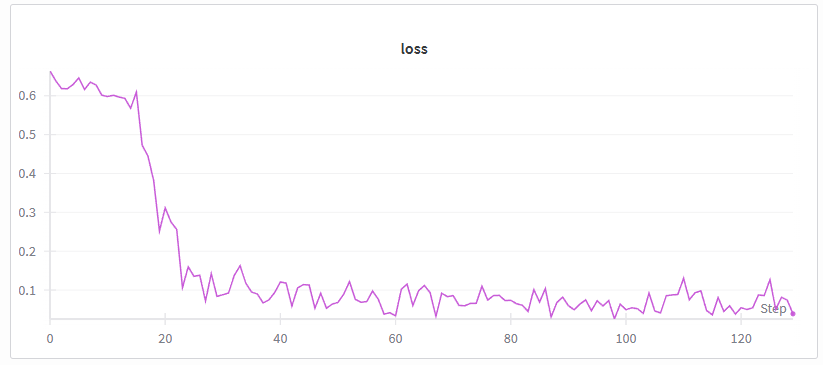
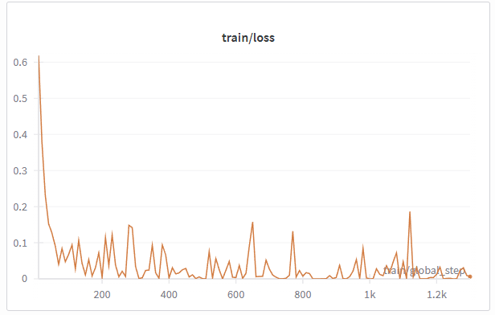
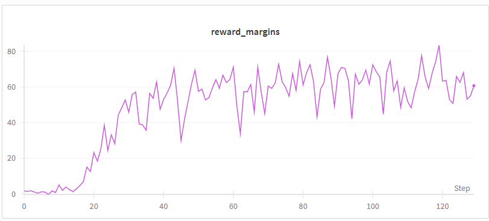
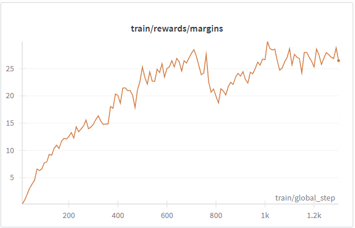

# dpo-scratch
This project is to build **Direct Preference Optimization (DPO)** from scratch for study or research usage.

There are two realized pipeline in this project
* **Written DPO**: implement dpo from scratch
* **HuggingFcae DPO**: implement dpo by using huggingface pipeline

Monitoring the dpo loss and reward margins to prove dpo running performance.

## Project Overview
- **policy**: Llama 3.2-1B
- **ref_model**: Llama 3.2-1B  
- **Dataset**: Intel/orca_dpo_pairs
- **log**: wandb
- **Training GPU**: NVIDIA H100 80GB GPU 

---

## Project Structure
```bash
│
├── src/ # Source code
│ ├── dpo_loss.py # compute the dpo loss
│ ├── batch_log_prob.py # compute the log probability for every batch 
│ ├── dataset_process.py # build train/eval dataset
│ ├── training.py # dpo training
│ ├── hf_dpo_training.py # huggingface dpo implementation pipeline
| └── config_sft_dpo.yaml # config for our entire pipline
|
├── docs/ # figures and tables 
|  
├── requirements.txt
└── README.md 
```

---

## Scratch Details

### DPO Loss
The key idea of implementing DPO is to compute the DPO loss  
[*Direct Preference Optimization: Your Language Model is Secretly a Reward Model*](https://arxiv.org/abs/2305.18290).

```math
\mathcal{L}_{\text{DPO}}(\pi_\theta;\,\pi_{\text{ref}})
= - \mathbb{E}_{(x, y^+, y^-) \sim D}\!\left[
\log \sigma\!\left(
\beta \left(
\log \frac{\pi_\theta(y^+ \mid x)}{\pi_{\text{ref}}(y^+ \mid x)}
-
\log \frac{\pi_\theta(y^- \mid x)}{\pi_{\text{ref}}(y^- \mid x)}
\right)
\right)
\right]
```

where:

| Symbol | Description |
|:--|:--|
| $$\pi_\theta$$ | Policy model (target model being fine-tuned) |
| $$\pi_{\text{ref}}$$ | Frozen reference model |
| $$D$$ | Dataset of human preference pairs |
| $$y^+$$ | Chosen (preferred) response |
| $$y^-$$ | Rejected (dispreferred) response |
| $$\beta$$ | Temperature-like hyperparameter controlling divergence strength |

The coefficient $$\beta$$ controls the trade-off between exploration and stability:
- Small $$\beta$$: conservative updates, model stays close to ref model.  
- Large $$\beta$$: stronger preference alignment but risk of overfitting. 

---

### Implementation Notes
For log probability calculation, we do the following process

#### Dataset Format
The dataset should contain the following fields:
- `question` — input text or instruction  
- `chosen` — preferred (human-approved) output  
- `rejected` — less-preferred output  

---

#### Truncation & Tokenization
- Both `question` and `chosen/rejected` texts are **tokenized and truncated**   
- For models such as **Llama** and **GPT**, which do not define a padding token, 
```bash
  tokenizer.pad_token = tokenizer.eos_token
```
So we do not have to process pad token mask.
- Only calculate the response log
Use mask to split prompt and response from the combination of prompt-chosen/rejected

---

## Using Pipeline

### 1. Installation
Clone and install dependencies:
```bash
git clone https://github.com/YangQ411/dpo-scratch.git
cd dpo-scratch
pip install -r requirements.txt
```

### 2. Authentication 
Login to HuggingFace and enter your tokens (Llama3.2-1B model):
```bash
huggingface-cli login
```

### 3. DPO training
```bash
python training.py --config config_dpo.yaml
```

### 4. HF_DPO training
```bash
python hf_dpo_training.py --config config_dpo.yaml
```

---

## Training Report

### Evaluataion Metric
| Metric | Description |
|---------|--------------|
| loss | DPO loss |
| reward_margin | Mean (adv_chosen - adv_rejected) |

* reward_margin → separation strength between good/bad responses, larger is better. 

---

### learning results
### Loss
<table>
  <tr>
    <th align="center">From-scratch (ours)</th>
    <th align="center">HF-TRL baseline</th>
  </tr>
  <tr>
    <td align="center"></td>
    <td align="center"></td>
  </tr>
</table>

**Interpretation.** Both curves descend quickly at the beginning then stabilize at a low level, indicating stable convergence.  
Our handwritten trainer matches the HF-TRL trend, which supports parity of the implementation.

---

### Reward Margin
<table>
  <tr>
    <th align="center">From-scratch (ours)</th>
    <th align="center">HF-TRL baseline</th>
  </tr>
  <tr>
    <td align="center"></td>
    <td align="center"></td>
  </tr>
</table>

**Interpretation.** The reward margin `(adv_chosen − adv_rejected)` grows steadily and plateaus, showing the policy is increasingly preferring the chosen responses relative to the reference.
